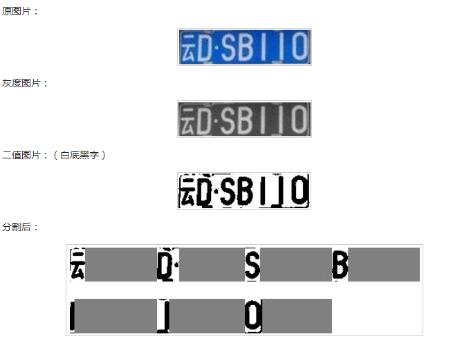

# ex:数字序列的分割
借助python、python-opencv实现含有数字文本的图像的分割操作。
输入图像的形式为：

要求输出

1. 灰度化结果
2. 二值化结果
3. 加个框
4. 分割结果单独输出

参考输出

# WARNING
对test_img/05.png这种和背景很接近的数字很难提取。不要指望本仓库里现有的代码能提取出来。

# 可供参考的材料
车牌识别、数字序列分割

https://www.cnblogs.com/beer/p/5672678.html

www.jb51.net/article/137487.htm
